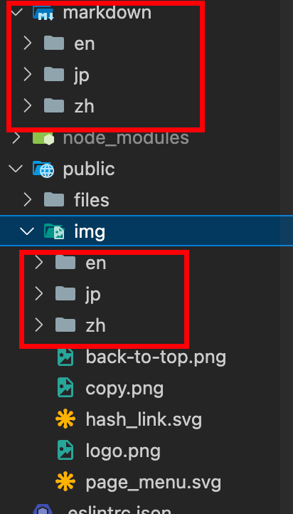

# AutoAgents.ai 灵搭平台文档中心

这是 AutoAgents.ai 灵搭平台的官方文档仓库，包含平台的使用指南、API 文档和示例智能体的使用说明。基于 Next.js 构建的现代化多语言文档站点。


## 文件结构

Markdown 文档按语言和类别组织：

```
markdown/
├── zh/                  # 中文文档
│   ├── getting-started/ # 快速开始
│   ├── agents/          # 智能体
│   ├── knowledge-base/  # 知识库
│   └── examples/        # 示例
├── en/                  # 英文文档
└── jp/                  # 日文文档
```


## Git 初学者文档开发指南

### 项目设置

#### 1. 克隆项目

```bash
# 克隆项目到本地
git clone https://github.com/autoagents-ai/docs.git
cd docs

# 安装依赖
npm install
```

#### 2. 开发流程

每次开发前，请按照以下步骤操作：

```bash
# 1. 切换到main分支
git checkout main

# 2. 拉取最新代码
git pull origin main

# 3. 切换到开发分支
git checkout feat/zhiwei

# 4. 将main分支的最新更改合并到开发分支
git merge main
```

#### 3. 启动开发服务器

```bash
# 启动开发服务器
npm run dev
```

现在你可以在 http://localhost:3000 访问网站。

### 更新文档内容

  <center>
    </img>
  </center>

#### 更新Markdown文件

1. Markdown文件位于以下目录：
   - 中文文档：`markdown/zh/`
   - 英文文档：`markdown/en/`
   - 日文文档：`markdown/jp/`

2. 编辑或添加Markdown文件时，请遵循以下格式：
   ```markdown
   ---
   title: 页面标题
   ---

   # 正文内容
   ```

#### 更新图片

1. 图片文件位于以下目录：
   - 中文图片：`public/img/zh/`
   - 英文图片：`public/img/en/`
   - 日文图片：`public/img/jp/`
2. 在Markdown中引用图片：
   ```plaintext
  <center>
    </img>
  </center>
   ```

### 提交更改

完成修改后，按以下步骤提交代码：

```bash
# 1. 查看修改的文件
git status

# 2. 添加修改的文件
git add .

# 3. 提交修改
git commit -m "docs: 更新文档内容"

# 4. 推送到远程分支
git push origin feat/zhiwei
```

### 创建Pull Request

1. 访问GitHub仓库页面 (https://github.com/autoagents-ai/docs)
2. 点击 "Pull requests" 标签
3. 点击 "New pull request" 按钮
4. 选择基础分支为 `main`，比较分支为 `feat/zhiwei`
5. 填写PR描述，说明更新内容
6. 点击 "Create pull request" 提交PR

### 构建项目

如需构建生产环境版本：

```bash
# 构建项目
npm run build

# 预览构建结果
npm run start
```

### 注意事项

1. 每次开发前记得先拉取最新代码（`git pull`）
2. 确保在正确的分支上工作（`feat/zhiwei`）
3. 提交前检查文件改动是否正确
4. 图片建议使用PNG或JPG格式，并进行适当压缩
5. 保持文档结构清晰，使用适当的标题层级

### 常见问题

#### 分支切换报错

如果有未提交的修改，切换分支时可能报错。解决方法：

```bash
# 暂存当前修改
git stash

# 切换分支
git checkout feat/zhiwei

# 恢复暂存的修改
git stash pop
```

#### 合并冲突

如果遇到合并冲突，请仔细检查冲突文件，手动解决冲突后再提交。

## 技术栈

- **Next.js 14**: React 框架
- **Tailwind CSS**: 样式系统
- **TypeScript**: 类型检查
- **React Markdown**: Markdown 渲染

## 许可证

本项目采用 MIT 许可证 - 查看 [LICENSE](LICENSE) 文件了解详细信息